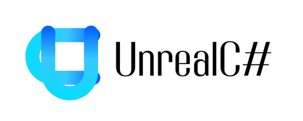

# 概述

&ensp;&ensp;&ensp;&ensp;UnrealCSharp是UE下C#编程插件，基于.NET 8（Mono）。提供多种编程模式，功能强大且容易上手，能够灵活高效地进行游戏开发。

# 特性列表

- 支持全部的反射类型，自动生成C#代码
- 能够静态导出各种数据类型和函数
- 拥有强大的动态类特性，可以通过C#直接生成UClass，UInterface，UStruct和UEnum，并且不需要蓝图载体
- 支持跨平台
- 简单方便的代码调试
- 能够通过Pak进行C#热更新
- 编辑器下，能够热重载C#变更

# 平台支持

- 运行平台：Windows / macOS / Linux / Android / IOS
- 引擎版本：Unreal Engine 5.0 - Unreal Engine 5.4

# 文档

- [开始上手](https://unrealcsharp.github.io/docs/document/getting-started)
- [动态类](https://unrealcsharp.github.io/docs/document/getting-started/dynamic)
- [调试](https://unrealcsharp.github.io/docs/document/guides/debug)
- [FAQ](https://unrealcsharp.github.io/docs/document/FAQ)

# 社区

- [官方QQ群：326576868](https://qm.qq.com/q/JW43uTiOk4)
- [Discord](https://discord.gg/mPVWhRqxC7)

# Contributors

    