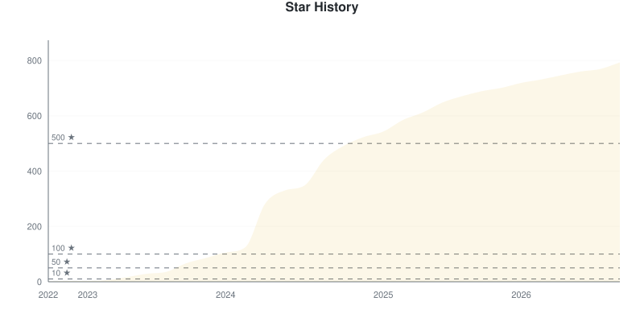
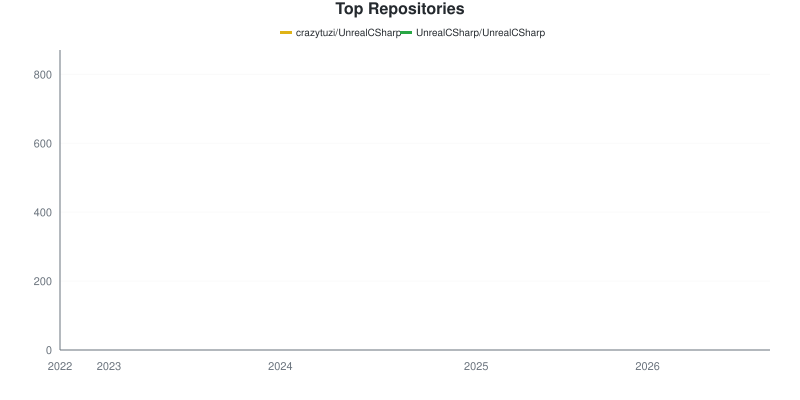
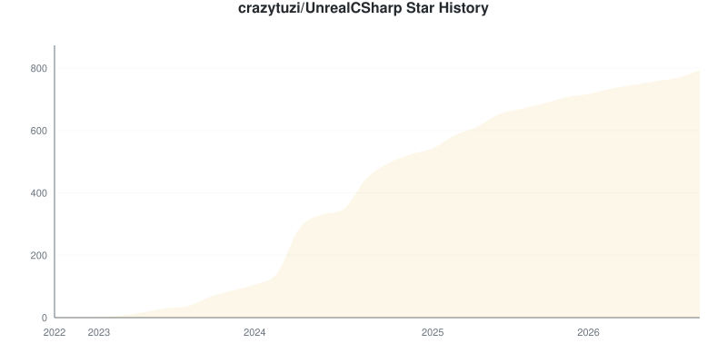
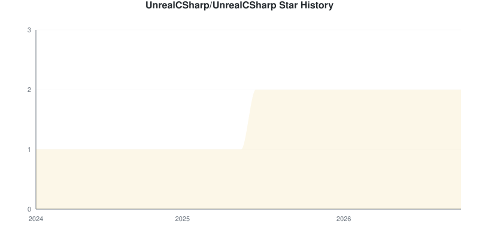
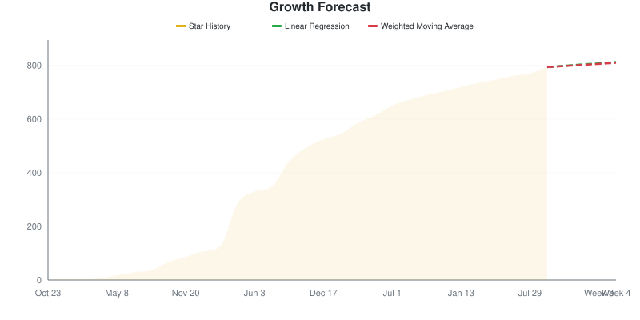

# Star Tracker Report

**2026-09-09** | Total: **791 stars** | Change: **-1**

> Compared to snapshot from 2026-09-08

## 📈 Star Trend

### By Repository

Individual Repository Charts

#### crazytuzi/UnrealCSharp: 789 ★ (-1)

#### UnrealCSharp/UnrealCSharp: 2 ★ (0)

## Repositories

| Repositories | Stars | Change | Trend |
|:-----------|------:|-------:|:-----:|
| [crazytuzi/UnrealCSharp](https://github.com/crazytuzi/UnrealCSharp) | 789 | -1 | ⬇️ |
| [UnrealCSharp/UnrealCSharp](https://github.com/UnrealCSharp/UnrealCSharp) | 2 | 0 | ➖ |

## Summary

- **Stars gained:** 0
- **Stars lost:** 1
- **Net change:** -1

## 🔮 Growth Forecast

**Aggregate Forecast**

| Method | Week 1 | Week 2 | Week 3 | Week 4 |
|:---|---:|---:|---:|---:|
| Linear Regression | 796 | 801 | 805 | 810 |
| Weighted Moving Average | 795 | 799 | 803 | 807 |

### By Repository

crazytuzi/UnrealCSharp

**crazytuzi/UnrealCSharp**

| Method | Week 1 | Week 2 | Week 3 | Week 4 |
|:---|---:|---:|---:|---:|
| Linear Regression | 794 | 799 | 803 | 808 |
| Weighted Moving Average | 793 | 797 | 801 | 805 |

UnrealCSharp/UnrealCSharp

**UnrealCSharp/UnrealCSharp**

| Method | Week 1 | Week 2 | Week 3 | Week 4 |
|:---|---:|---:|---:|---:|
| Linear Regression | 2 | 2 | 2 | 2 |
| Weighted Moving Average | 2 | 2 | 2 | 2 |

---
*Generated by [GitHub Star Tracker](https://github.com/fbuireu/github-star-tracker) on 2026-09-09T03:13:00.511Z*

*Made with 🤘 by [Ferran Buireu](https://github.com/fbuireu)*

