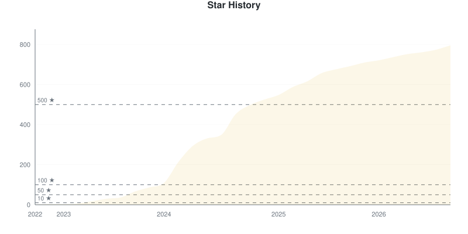
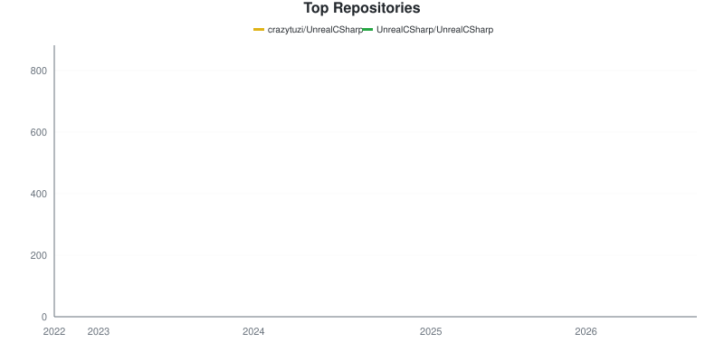
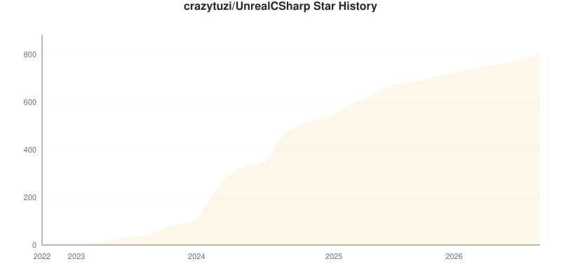
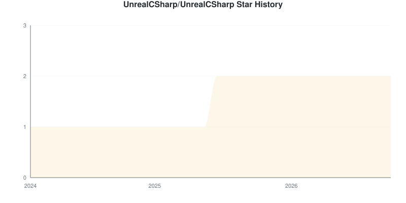
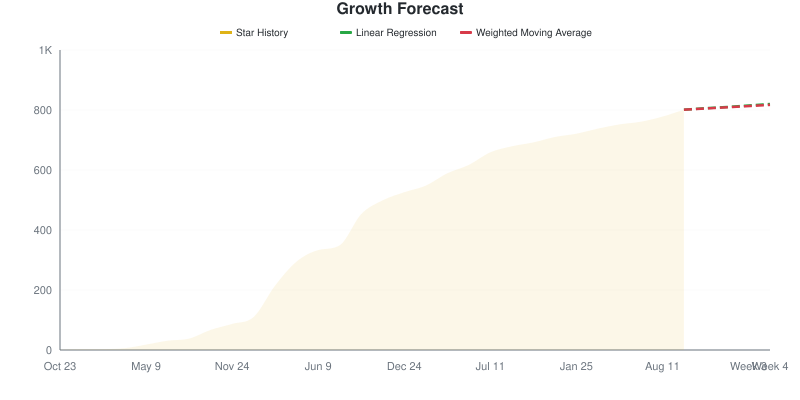

# Star Tracker Report

**2026-10-04** | Total: **803 stars** | Change: **+1**

> Compared to snapshot from 2026-10-03

## 📈 Star Trend

### By Repository

Individual Repository Charts

#### crazytuzi/UnrealCSharp: 801 ★ (+1)

#### UnrealCSharp/UnrealCSharp: 2 ★ (0)

## Repositories

| Repositories | Stars | Change | Trend |
|:-----------|------:|-------:|:-----:|
| [crazytuzi/UnrealCSharp](https://github.com/crazytuzi/UnrealCSharp) | 801 | +1 | ⬆️ |
| [UnrealCSharp/UnrealCSharp](https://github.com/UnrealCSharp/UnrealCSharp) | 2 | 0 | ➖ |

## Summary

- **Stars gained:** 1
- **Stars lost:** 0
- **Net change:** +1

## 🔮 Growth Forecast

**Aggregate Forecast**

| Method | Week 1 | Week 2 | Week 3 | Week 4 |
|:---|---:|---:|---:|---:|
| Linear Regression | 808 | 812 | 817 | 822 |
| Weighted Moving Average | 807 | 811 | 815 | 819 |

### By Repository

crazytuzi/UnrealCSharp

**crazytuzi/UnrealCSharp**

| Method | Week 1 | Week 2 | Week 3 | Week 4 |
|:---|---:|---:|---:|---:|
| Linear Regression | 806 | 810 | 815 | 820 |
| Weighted Moving Average | 805 | 809 | 813 | 816 |

UnrealCSharp/UnrealCSharp

**UnrealCSharp/UnrealCSharp**

| Method | Week 1 | Week 2 | Week 3 | Week 4 |
|:---|---:|---:|---:|---:|
| Linear Regression | 2 | 2 | 2 | 2 |
| Weighted Moving Average | 2 | 2 | 2 | 2 |

---
*Generated by [GitHub Star Tracker](https://github.com/fbuireu/github-star-tracker) on 2026-10-04T04:25:18.692Z*

*Made with 🤘 by [Ferran Buireu](https://github.com/fbuireu)*

