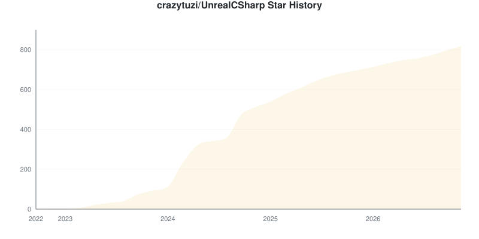
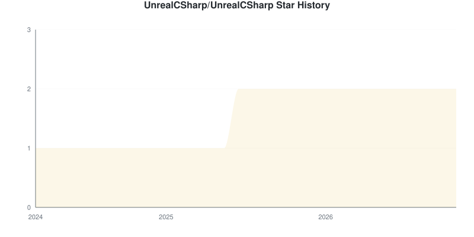

# Star Tracker Report

**2026-11-23** | Total: **818 stars** | Change: **-1**

> Compared to snapshot from 2026-11-22

## 📈 Star Trend

### By Repository

Individual Repository Charts

#### crazytuzi/UnrealCSharp: 816 ★ (-1)

#### UnrealCSharp/UnrealCSharp: 2 ★ (0)

## Repositories

| Repositories | Stars | Change | Trend |
|:-----------|------:|-------:|:-----:|
| [crazytuzi/UnrealCSharp](https://github.com/crazytuzi/UnrealCSharp) | 816 | -1 | ⬇️ |
| [UnrealCSharp/UnrealCSharp](https://github.com/UnrealCSharp/UnrealCSharp) | 2 | 0 | ➖ |

## Summary

- **Stars gained:** 0
- **Stars lost:** 1
- **Net change:** -1

## 🔮 Growth Forecast

**Aggregate Forecast**

| Method | Week 1 | Week 2 | Week 3 | Week 4 |
|:---|---:|---:|---:|---:|
| Linear Regression | 823 | 827 | 832 | 836 |
| Weighted Moving Average | 822 | 826 | 829 | 833 |

### By Repository

crazytuzi/UnrealCSharp

**crazytuzi/UnrealCSharp**

| Method | Week 1 | Week 2 | Week 3 | Week 4 |
|:---|---:|---:|---:|---:|
| Linear Regression | 821 | 825 | 830 | 834 |
| Weighted Moving Average | 820 | 824 | 827 | 831 |

UnrealCSharp/UnrealCSharp

**UnrealCSharp/UnrealCSharp**

| Method | Week 1 | Week 2 | Week 3 | Week 4 |
|:---|---:|---:|---:|---:|
| Linear Regression | 2 | 2 | 2 | 2 |
| Weighted Moving Average | 2 | 2 | 2 | 2 |

---
*Generated by [GitHub Star Tracker](https://github.com/fbuireu/github-star-tracker) on 2026-11-23T05:52:54.756Z*

*Made with 🤘 by [Ferran Buireu](https://github.com/fbuireu)*

