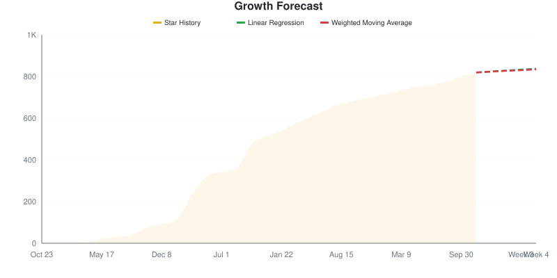

# Star Tracker Report

**2026-11-16** | Total: **821 stars** | Change: **0**

> Compared to snapshot from 2026-11-15

## 📈 Star Trend

### By Repository

Individual Repository Charts

#### crazytuzi/UnrealCSharp: 819 ★ (0)

#### UnrealCSharp/UnrealCSharp: 2 ★ (0)

## Repositories

| Repositories | Stars | Change | Trend |
|:-----------|------:|-------:|:-----:|
| [crazytuzi/UnrealCSharp](https://github.com/crazytuzi/UnrealCSharp) | 819 | 0 | ➖ |
| [UnrealCSharp/UnrealCSharp](https://github.com/UnrealCSharp/UnrealCSharp) | 2 | 0 | ➖ |

## 🔮 Growth Forecast

**Aggregate Forecast**

| Method | Week 1 | Week 2 | Week 3 | Week 4 |
|:---|---:|---:|---:|---:|
| Linear Regression | 826 | 830 | 835 | 840 |
| Weighted Moving Average | 825 | 829 | 833 | 836 |

### By Repository

crazytuzi/UnrealCSharp

**crazytuzi/UnrealCSharp**

| Method | Week 1 | Week 2 | Week 3 | Week 4 |
|:---|---:|---:|---:|---:|
| Linear Regression | 824 | 828 | 833 | 838 |
| Weighted Moving Average | 823 | 827 | 831 | 834 |

UnrealCSharp/UnrealCSharp

**UnrealCSharp/UnrealCSharp**

| Method | Week 1 | Week 2 | Week 3 | Week 4 |
|:---|---:|---:|---:|---:|
| Linear Regression | 2 | 2 | 2 | 2 |
| Weighted Moving Average | 2 | 2 | 2 | 2 |

---
*Generated by [GitHub Star Tracker](https://github.com/fbuireu/github-star-tracker) on 2026-11-16T04:52:04.180Z*

*Made with 🤘 by [Ferran Buireu](https://github.com/fbuireu)*

